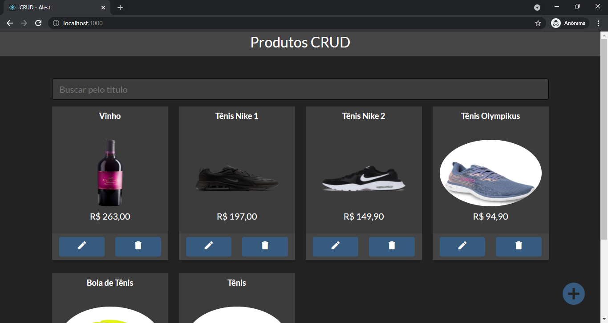
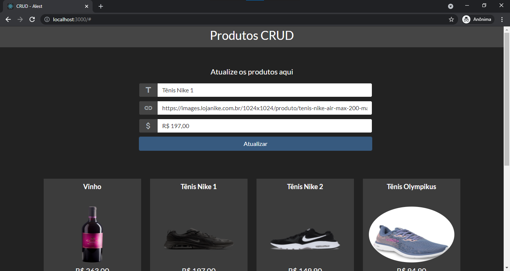

# CRUD_Alest_Consultoria

 

A ReactJS challenge for a Internship vacancy

<h4 align="center"> 
	🚧  CRUD-ReactJS 🚀 <a href="https://fb-crud-react-79886.web.app/" target="_blank">Preview on Firebase Hosting</a>  🚧
</h4>

---

## Features

- [x] Receive data from user and add to Firestore database
- [x] Return all data in Card Format
- [x] Edit button Working with Firestore
- [x] Delete button working with Firestore
- [x] Hide Form default
- [x] Show form when tap plus or edit button
- [x] Search bar working with title data

---

## App Preview

  
  
  

---

## Developer Quick start

1. [Install Pre-requisites](#pre-requisites)
1. [Clone](#clone-the-repo)
1. [Download third party libs](#download-third-party-libs)
1. [Run crud_alest](#run-crud_alest)

---

### Pre-requisites

- Install [NodeJS](https://nodejs.org/en/).
- Setup your [favorite code editor](https://flutter.dev/docs/get-started/editor) (I recommend using [VS Code](https://code.visualstudio.com/))

---

### Clone the repo

    git clone git@github.com:alex-cerlini/alest-crud-react.git

---

### Download Third Party Libs

1. run `npm install` to download all the librarys used in project (do it or have a million error in project)

---

### Run crud_alest

- Run `npm start`

---

## Technology

- HTML5
- CSS3
- Bootstrap
- JavaScript
- ReactJS
- NodeJS
- Firestore database
- Firestore hosting
- Toastify

---

## Author

---

<a href="https://github.com/alex-cerlini">
 
  
 <b>Alexander Andrade Cerlini</b></a> <a href="https://github.com/alex-cerlini" title="Alex Cerlini">🚀</a>

Feito com ♥.

